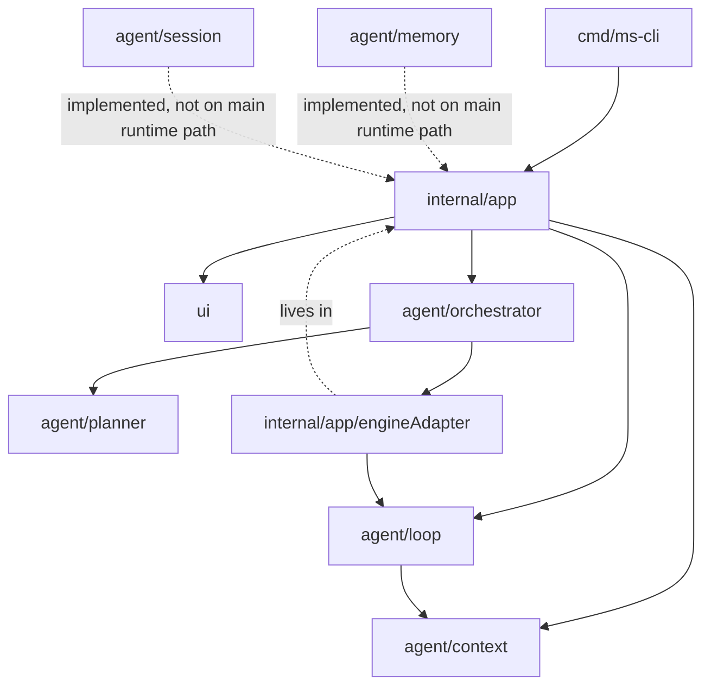

# App and Agent Relationship

This note focuses on the relationship between `internal/app/` and `agent/`.

## Dependency View



## Runtime Flow

```mermaid
sequenceDiagram
    participant UI as ui/app.go
    participant APP as internal/app/run.go
    participant ORCH as agent/orchestrator
    participant ADAPTER as internal/app/adapter.go
    participant LOOP as agent/loop

    UI->>APP: user input string
    APP->>APP: processInput()
    APP->>ORCH: Run(RunRequest)
    ORCH->>ADAPTER: Engine.Run(req)
    ADAPTER->>LOOP: RunWithContext(loop.Task)
    LOOP-->>ADAPTER: []loop.Event
    ADAPTER-->>ORCH: []RunEvent
    ORCH-->>APP: []RunEvent
    APP->>APP: convertRunEvent()
    APP-->>UI: model.Event via EventCh
```

## Current Boundary

- `internal/app` is the composition root.
- `internal/app` knows both `agent/orchestrator` and `agent/loop`.
- `agent/orchestrator` no longer imports `agent/loop`.
- `internal/app/adapter.go` bridges `orchestrator.RunRequest` to `loop.Task`.
- `agent/loop` remains the concrete execution engine.

## Responsibility Split

- `internal/app`
  - wires dependencies
  - owns adapters
  - starts the TUI
  - still converts runtime events into UI events

- `agent/orchestrator`
  - owns orchestration-level request and event types
  - chooses standard mode vs plan mode
  - delegates execution to an engine interface

- `agent/loop`
  - runs the concrete ReAct loop
  - talks to LLM, tools, permission, and trace
  - owns loop-specific execution details

## Important Note

The current flow still has two translation boundaries:

1. `RunRequest -> loop.Task` in `internal/app/adapter.go`
2. `RunEvent -> model.Event` in `internal/app/run.go`

So the app-to-agent boundary is cleaner than before, but event unification and streaming are still separate follow-up concerns.

## Main Files Table

This table focuses on the main execution chain only: `internal/app`, `agent/orchestrator`, `agent/planner`, and `agent/loop`.

| File | Role | Main functions / types |
|---|---|---|
| [`internal/app/wire.go`](/Users/weizheng/work/tmp/ms-agent-project/ms-cli/internal/app/wire.go) | Composition root. Builds engine, adapter, orchestrator, tools, provider, and app state. | `Application` (#L32), `BootstrapConfig` (#L50), `Wire(...)` (#L59), `SetProvider(...)` (#L174), `SaveState()` (#L239) |
| [`internal/app/run.go`](/Users/weizheng/work/tmp/ms-agent-project/ms-cli/internal/app/run.go) | Runtime entry for TUI loop and task dispatch from UI input. | `Run(...)` (#L19), `run()` (#L46), `runReal()` (#L57), `inputLoop(...)` (#L69), `processInput(...)` (#L75), `runTask(...)` (#L89), `convertRunEvent(...)` (#L128), `runDemo()` (#L173) |
| [`internal/app/adapter.go`](/Users/weizheng/work/tmp/ms-agent-project/ms-cli/internal/app/adapter.go) | Adapter between orchestrator-owned request/event types and loop-owned task/event types. | `engineAdapter` (#L12), `newEngineAdapter(...)` (#L16), `Execute(...)` (#L22) |
| [`internal/app/commands.go`](/Users/weizheng/work/tmp/ms-agent-project/ms-cli/internal/app/commands.go) | Slash command handling that still lives in app layer. | `handleCommand(...)` (#L15), `cmdRoadmap(...)` (#L52), `cmdWeekly(...)` (#L84), `cmdModel(...)` (#L110), `switchModel(...)` (#L166), `cmdPermission(...)` (#L255), `cmdHelp()` (#L364) |
| [`agent/orchestrator/types.go`](/Users/weizheng/work/tmp/ms-agent-project/ms-cli/agent/orchestrator/types.go) | Orchestration-level request and event contract. | `RunRequest` (#L6), `RunEvent` (#L12), `NewRunEvent(...)` (#L24) |
| [`agent/orchestrator/orchestrator.go`](/Users/weizheng/work/tmp/ms-agent-project/ms-cli/agent/orchestrator/orchestrator.go) | Thin dispatch layer: planner decides mode, orchestrator chooses executor. | `AgentExecutor` (#L13), `WorkflowExecutor` (#L18), `Config` (#L23), `Orchestrator` (#L29), `New(...)` (#L38), `SetCallback(...)` (#L49), `Run(...)` (#L59), `dispatch(...)` (#L75), `runWorkflow(...)` (#L85), `runStepsViaAgent(...)` (#L113) |
| [`agent/orchestrator/modes.go`](/Users/weizheng/work/tmp/ms-agent-project/ms-cli/agent/orchestrator/modes.go) | Plan lifecycle callback contract. | `PlanCallback` (#L6), `NoOpCallback` (#L23) |
| [`agent/planner/plan.go`](/Users/weizheng/work/tmp/ms-agent-project/ms-cli/agent/planner/plan.go) | Structured planner output contract. | `ExecutionMode` (#L4), `Plan` (#L15) |
| [`agent/planner/planner.go`](/Users/weizheng/work/tmp/ms-agent-project/ms-cli/agent/planner/planner.go) | Calls the LLM, parses output, and returns structured plans. | `Config` (#L13), `DefaultConfig()` (#L19), `Planner` (#L27), `New(...)` (#L33), `Plan(...)` (#L43), `Refine(...)` (#L77) |
| [`agent/planner/parser.go`](/Users/weizheng/work/tmp/ms-agent-project/ms-cli/agent/planner/parser.go) | Extracts `Plan` from LLM output with JSON and legacy fallbacks. | `parsePlan(...)` (#L12), `parsePlanJSON(...)` (#L43), `parseStepArray(...)` (#L62), `parseLines(...)` (#L79), `extractJSONObject(...)` (#L112), `extractJSONArray(...)` (#L133) |
| [`agent/planner/prompt.go`](/Users/weizheng/work/tmp/ms-agent-project/ms-cli/agent/planner/prompt.go) | Prompt templates for plan generation and refinement. | `buildPlanPrompt(...)` (#L8), `buildRefinePrompt(...)` (#L46) |
| [`agent/planner/step.go`](/Users/weizheng/work/tmp/ms-agent-project/ms-cli/agent/planner/step.go) | Step model for workflow-style plans. | `Step` (#L5) |
| [`agent/planner/validator.go`](/Users/weizheng/work/tmp/ms-agent-project/ms-cli/agent/planner/validator.go) | Step validation against tool set and structure rules. | `ValidationError`, `ValidateSteps(...)` |
| [`agent/loop/types.go`](/Users/weizheng/work/tmp/ms-agent-project/ms-cli/agent/loop/types.go) | Loop-internal task and event transport types. | `Task` (#L10), `Event` (#L17), `NewEvent(...)` (#L31) |
| [`agent/loop/engine.go`](/Users/weizheng/work/tmp/ms-agent-project/ms-cli/agent/loop/engine.go) | Concrete ReAct execution engine: LLM, tool calls, permissions, tracing. | `EngineConfig` (#L18), `Engine` (#L27), `NewEngine(...)` (#L37), `SetContextManager(...)` (#L62), `SetPermissionService(...)` (#L78), `SetTraceWriter(...)` (#L83), `ToolNames()` (#L88), `Run(...)` (#L98), `RunWithContext(...)` (#L103), `executor.run(...)` (#L144), `callLLM(...)` (#L183), `handleResponse(...)` (#L218), `executeToolCall(...)` (#L240) |
